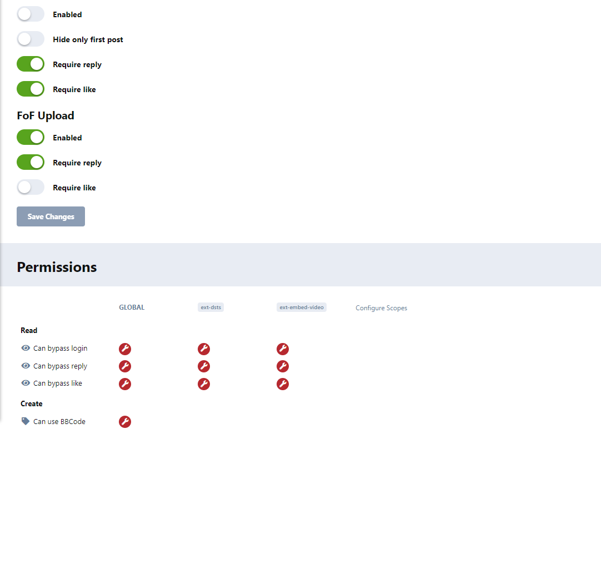
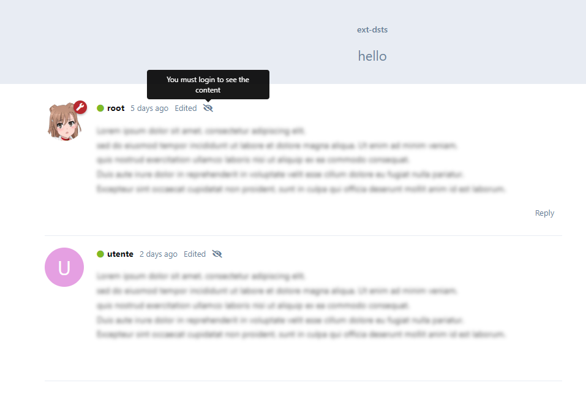
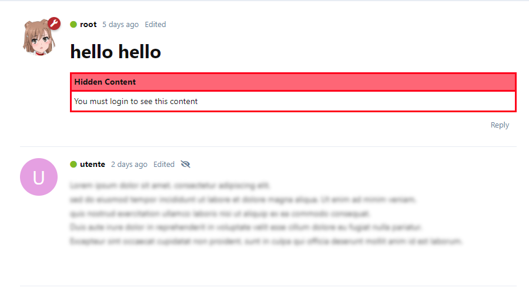
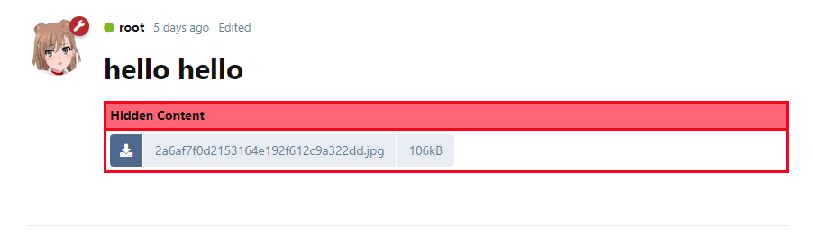
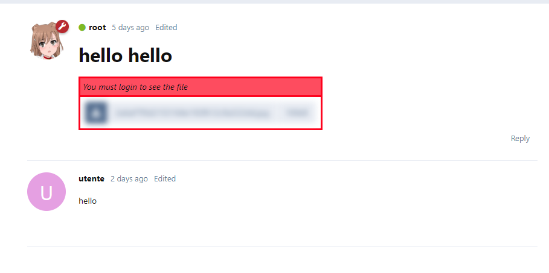

# Screenshots

## Extension Settings (Admin)

## Global element view

**NOTE**: the text under the blur will be a random lorem ipsum paragraph.

## BBCode element view

**NOTE**: if a bbcode element is found in a post,
all the other settings (global or extensions) will be ignored.

## BBCode element view (user has logged in)

## FoF/upload element view

In this example, only the fof/upload settings are enabled.

